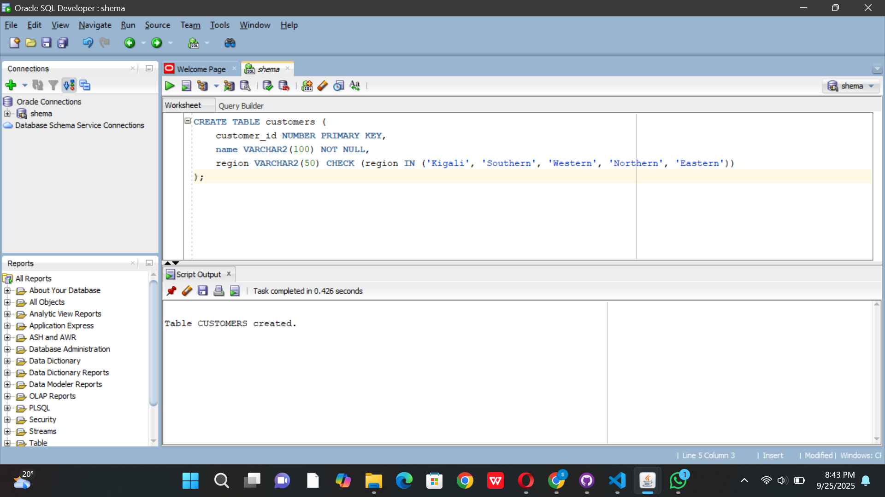
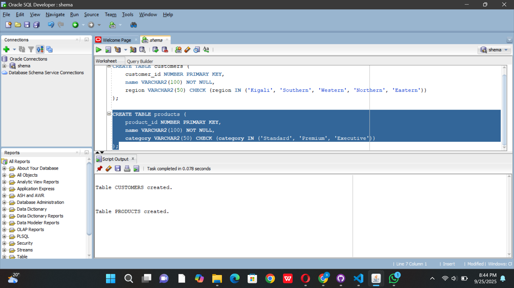
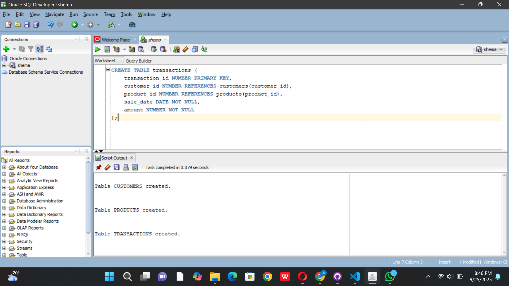
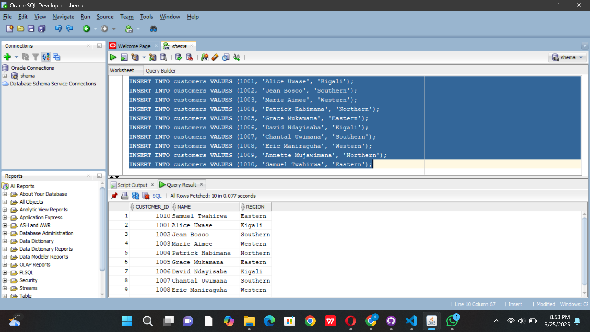
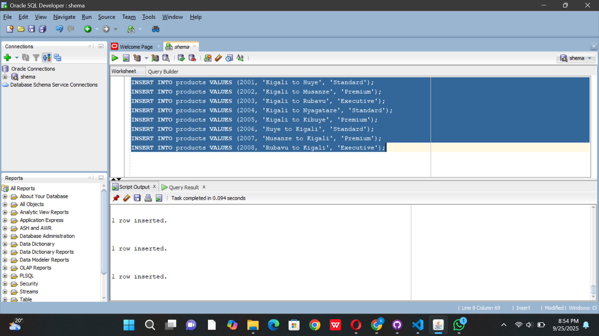
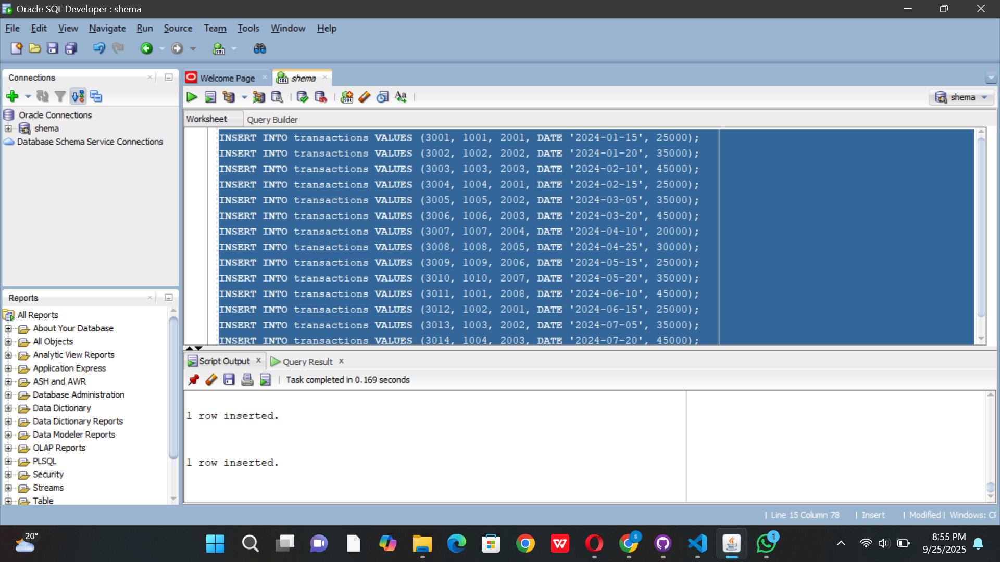
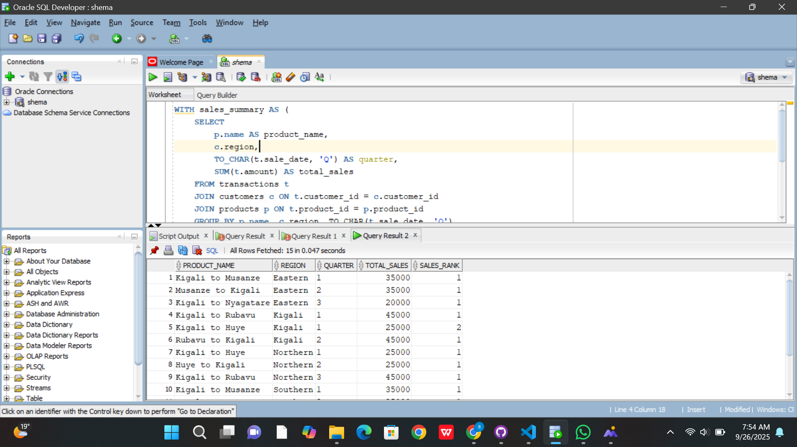
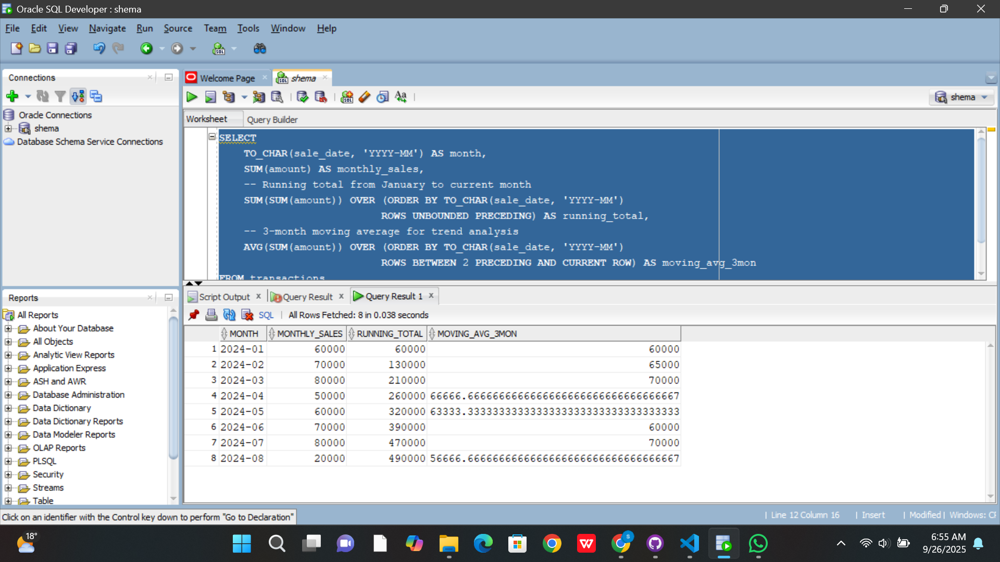
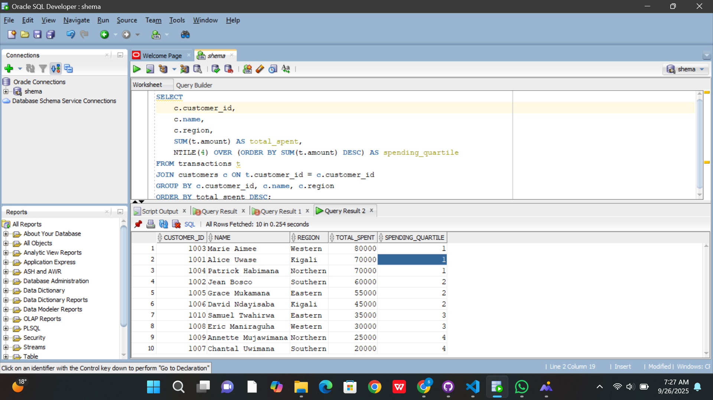

# PL/SQL Window Functions Assignment

**Student:** Shema Joel

**Course:** Database Development with PL/SQL (INSY 8311)  

**Instructor:** Eric Maniraguha 

**Date:** 2025-09-25

=====================================================================
## 🎯 1. Problem Definition
*Business Context:*  
-Company: Ritco Rwanda  
-Department: Business Intelligence & Revenue Management  
-Industry: Public Transportation

=======================================================================

**Data Challenge:**  
The company collects data on ticket sales, customer regions, and route transactions, but it currently lacks insights into route performance, regional sales trends, passenger growth patterns, and customer segmentation for loyalty programs.

=======================================================================
**Expected Outcome:**  
Management wants to:  
- Identify top routes per region  
- Calculate running monthly revenue totals  
- Analyze month-over-month passenger growth  
- Segment customers into spending quartiles  
- Compute 3-month moving averages for trend analysis

=======================================================================

## 📈 2. Success Criteria
1. Top 5 routes per region/quarter → RANK()  
2. Running monthly sales totals → SUM() OVER()  
3. Month-over-month growth → LAG()/LEAD()  
4. Customer quartiles → NTILE(4)  
5. 3-month moving averages → AVG() OVER()

=======================================================================

## 📈 3. Database Schema
**Tables:**  

- **Customers Table:** Stores customer details such as name, region, and customer ID.  
- **Products Table:** Stores route catalog information including route name and category.  
- **Transactions Table:** Stores each ticket sale with customer ID, product ID, sale date, and amount.

**Screenshots:**### Table Creation

### Table Creation

### Table Creation

         

- Customers: 10 sample customers across different Rwandan regions.  
- Products: 6-8 Ritco bus routes (e.g., Kigali-Huye, Kigali-Musanze, Kigali-Rubavu).  
- Transactions: 15+ transactions linking customers to routes with dates and ticket amounts.

**Screenshots:**### Sample Data

### Sample Data

### Sample Data

=======================================================================
## 📈 4. Window Functions

### *Ranking Function:* 
I ranked the Top N Routes by Revenue per Region and calculated total revenue per route and ranked them by region and quarter.

**Interpretation:**
The top routes by total revenue per region are identified. RANK() shows positions with gaps for ties, DENSE_RANK() avoids gaps, and ROW_NUMBER() uniquely numbers each route within its region and quarter.

### *Aggregate Function:* 
Running total of revenue by month and 3-month moving averages

**Interpretation:** 

-running_total: Shows cumulative revenue growth month by month.

-moving_avg_3mon: Smooths out fluctuations by averaging current and previous two months.

-This gives a clear picture of revenue trends and seasonal patterns for Ritco operations.

### *Navigation Function:* 
#### LAG()

**Interpretation:** 

-Shows the current month's revenue and the previous month's revenue.

-Helps calculate growth percentages and identify seasonal patterns for bus scheduling.

### *Distribution Function:* 
#### NTILE()

**Interpretation:** 
-Divides customers into 4 spending groups based on total ticket purchases.

-Quartile 1 = top spenders, Quartile 4 = occasional travelers.

-Helps design targeted loyalty programs and marketing campaigns.

=====================================================================

## 📈 5. Results Analysis

### Descriptive Analysis
Kigali-Huye route is the top-performing route across most regions, generating the highest revenue. Revenue shows consistent growth from January to July 2024. Kigali region contributes the most to overall sales, while premium and executive routes outperform standard categories.

### Diagnostic Analysis
Long-distance routes like Kigali-Rubavu drive higher revenue due to premium pricing. Monthly growth reflects seasonal travel patterns and holiday demand. Regional performance variations are influenced by population density and economic activity levels.

### Prescriptive Analysis
Increase frequency on Kigali-Huye route during peak travel periods. Introduce dynamic pricing for holiday seasons. Develop loyalty programs for high-spending customers in top quartile. Optimize bus allocation based on regional performance data.

==========================================================
## 📚 References

1. Oracle Corporation. (2023). Oracle Database SQL Language Reference - Analytic Functions. [Link](https://docs.oracle.com/en/database/oracle/oracle-database/19/sqlrf/Analytic-Functions.html)

2. Ritco Rwanda Official Website. (2024). Route Information and Schedules. [Link](https://ritco.rw)

3. Rwanda Utilities Regulatory Authority. (2024). Transport Statistics and Reports. [Link](https://www.rura.rw)

4. Oracle Base. (2023). Analytic Functions in Oracle. [Link](https://oracle-base.com/articles/misc/analytic-functions)

5. Ministry of Infrastructure Rwanda. (2024). National Transport Sector Reports. [Link](https://www.mininfra.gov.rw)

6. PostgreSQL Tutorial. (2024). Window Functions Guide. [Link](https://www.postgresqltutorial.com/postgresql-window-function/)

7. W3Schools. (2024). SQL Window Functions Tutorial. [Link](https://www.w3schools.com/sql/sql_window_functions.asp)

8. IBM Documentation. (2024). DB2 SQL Analytical Functions. [Link](https://www.ibm.com/docs/en/db2/11.5?topic=functions-analytical)

9. Stack Overflow. (2024). Window Functions Discussions. [Link](https://stackoverflow.com/questions/tagged/window-functions)

10. GitHub. (2024). SQL Window Functions Examples. [Link](https://github.com/topics/sql-window-functions)

==================================================================

## *Integrity Statement:*  
"All sources were properly cited. Implementations and analysis represent original work. No AI-generated content was copied without attribution or adaptation."
